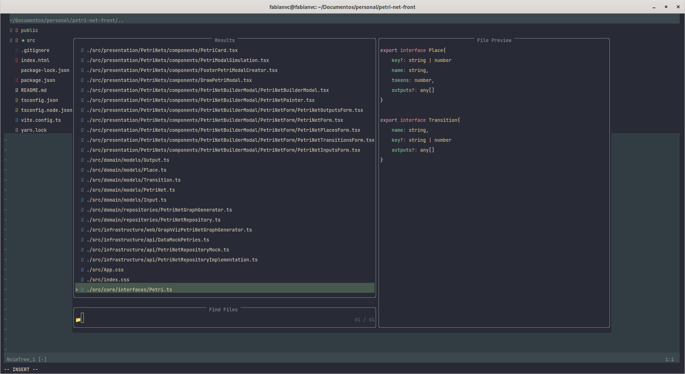
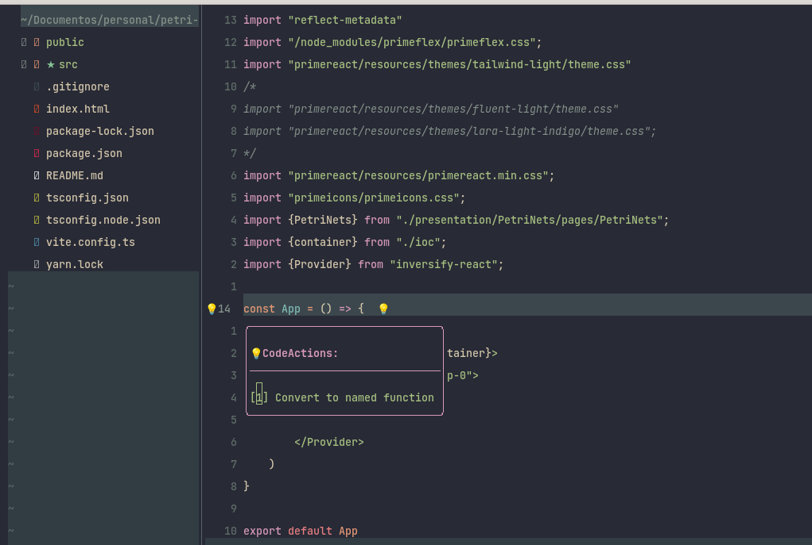
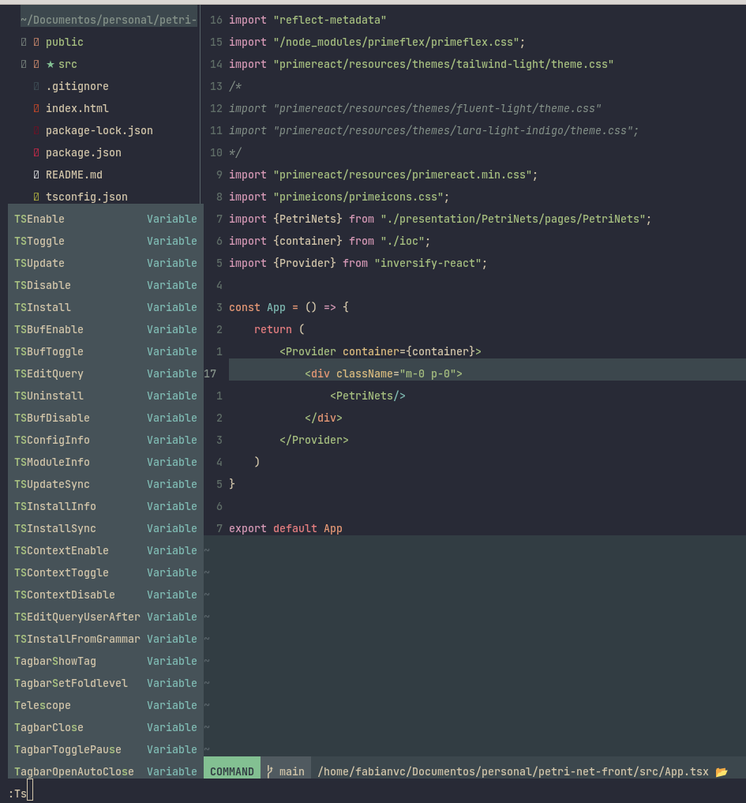
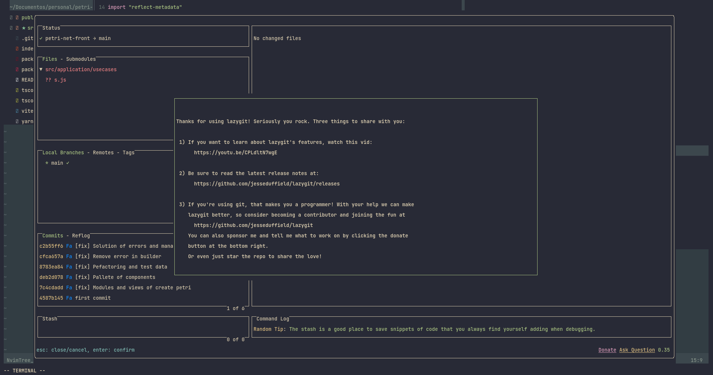

    

<h1 style="margin-top:10px;" align="center"> 🚀
  <strong> VERAVIM </strong> 🔭
</h1>

<!--toc:start-->
- [🐧 Project explanation](#🐧-project-explanation)
- [📷 Screenshots](#📷-screenshots)
  - [🦀 Images](#🦀-images)
- [👾 To get started](#👾-to-get-started)
- [🔥 Use](#🔥-use)
- [🙂 Coming soon](#🙂-coming-soon)
- [🖋️ Authors](#🖋️-authors)
<!--toc:end-->

## 🐧 Project explanation

It is a project which seeks to establish a quick configuration of nvim as a development environment, 
this setup has git integration and a syntax highlighting handler called TreeSitter as well as a file
browser and integration with a plugin that allows you to install different Language Server Protocol packages, for the different programming languages.

## 📷 Screenshots

### 🦀 Images

  

  

  

  

  

## 👾 To get started
1. Clone this repository
2. Install Packer in your OS
3. Install dependencies``:PackerInstall ``

## 🔥 Use

1. Syntax highlighting ``:TSInstall language_name``
2. LSP installer ``:LSPInstall language_name``
3. Find files ``<Alt>f``
4. Find in files ``<Alt-Mayus>f``
5. Git integration ``<Alt>g``
6. Lsp saga integration ``:Lspsaga code_action``
7. Tagbar integration ``<Alt>t ``

## 🙂 Coming soon

1. Refactoring integration 🍟 
2. Linting tools 🍟 

## 🖋️ Authors

The developers have contributed to this project:

* Fabian Vera Carrillo 🙂 - <a href="https://github.com/fabianvera728"> fabianvera728 </a>
